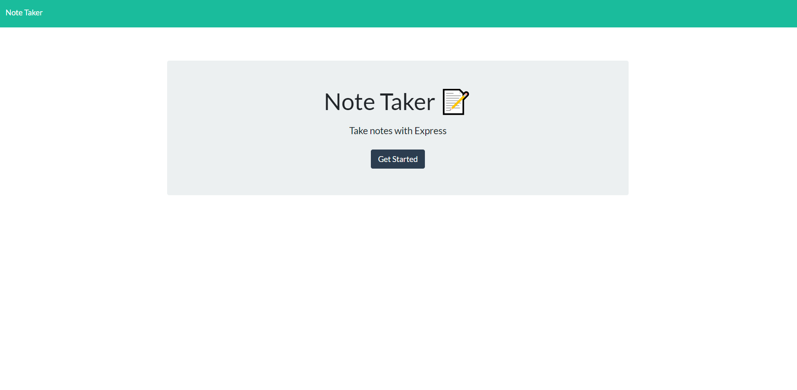

# Note Taker
https://dashboard.heroku.com/apps/notetaker-dennisk



Note Taker is an app that allows you to take down important information and save it in a database. This application takes on standard front end languages such as HTML, CSS, and Javascript. But also implements Express.js for the back end. 

## Installation

To start git clone the project and install the following dependencies. 

```bash
npm init
npm i express
```
## Usage
to start the project:

```bash
npm start
```

## Contributing
Pull requests are welcome. For major changes, please open an issue first to discuss what you would like to change.


## License
N/A
